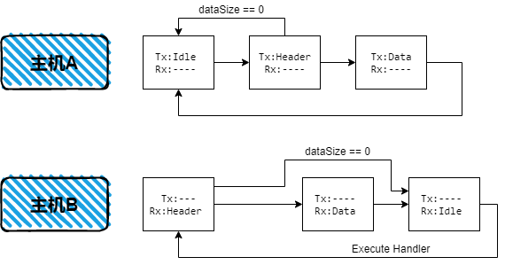

# SYS_RMCALL

[TOC]

## 简介

远程调用组件（RMCALL，Remote Call Module），是利用串行接口或其他传输协议，远程调用其他计算机程序的特定函数的组件。本组件常用于双单片机、多单片机、单片机系统与上位机协同工作时的功能调用和消息传递。RMCALL字节序采用小端序。


## 版本说明

### ~~v0.1-beta.0仍未发布~~

by CkovMk @hitsic 2020.10.07

**改动说明**

- 首个版本。

**开发计划**

- 增加超时功能
- 增加对超长数据（大于64KB）的支持
- 抽象通信接口，支持其他传输方式
- 全双工传输支持

**已知问题**

- 暂无


## API文档


## 设计文档

### 概论

RMCALL的核心思想是传输数据。在一次传输中，发送方发送`header`，接收方根据`header`中的信息接收数据并返回`status`。随后接收方调用对应回调函数。

`header`和`status`大小均为4字节，定义如下：

```c++
union message_t
{
    __attribute__ ((__packed__))struct
    {
        uint8_t magic;			///< 魔数，在移植文件中定义。
        uint8_t itemId;			///< 变量ID
        uint16_t dataSize;		///< 数据大小，单位为字节。255为保留大小。
    }header;
    __attribute__ ((__packed__))struct
    {
        uint8_t magic;			///< 魔数，在移植文件中定义。
        uint8_t itemId;			///< 变量ID
        uint8_t status;			///< 状态标志位
        uint8_t custom;			///< 自定义数据
    }status;
};
```

当发送方发送的`header`中的`dataSize`==0时， 接收方将不会接收数据，而直接返回`status`。这种用法主要用于仅调用接收方功能，而无需传输数据的情况。


### 状态转换




**注意：目前RMCALL仅支持半双工传输，尝试全双工传输将触发未定义的行为**


## 应用指南


## 移植指南


